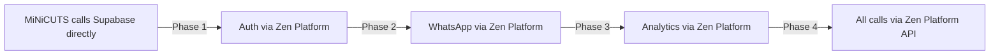

# ADR-0005: Incremental Migration Strategy

**Date:** 2026-09-01 | **Status:** Accepted | **Deciders:** Munir (owner)

## Context

Big-bang rewrites fail. MiNiCUTS is a live production system serving real customers daily.

## Decision

Migrate incrementally using the Strangler Fig pattern:
1. Keep MiNiCUTS HTML files running
2. Add Zen Platform services alongside
3. Progressively reroute calls from direct Supabase → Zen Platform API
4. Decommission direct Supabase calls once each service is stable

## Sequence

## Consequences

- ✅ Zero downtime migration
- ✅ Each phase can be rolled back independently
- ❌ Temporary dual-write complexity during transition
- ❌ Longer total migration timeline
