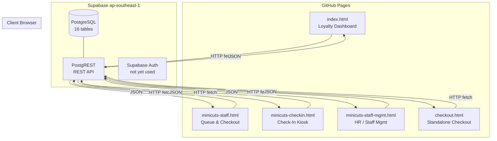
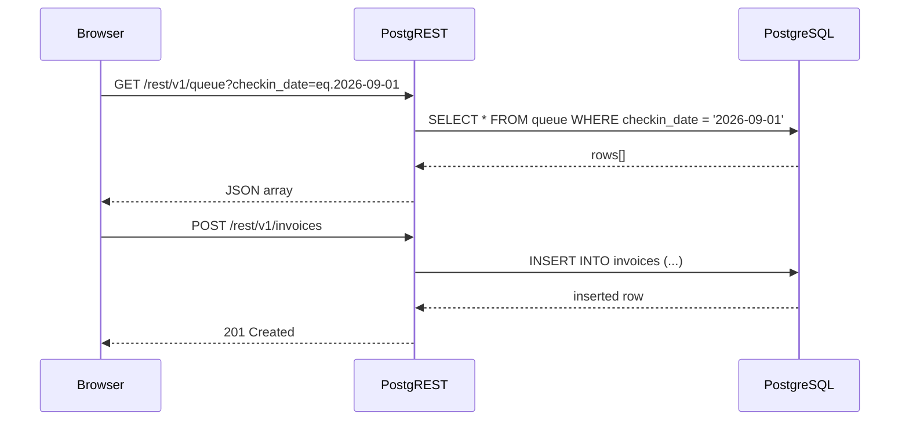

# Current Architecture — MiNiCUTS Loyalty

> **Last verified:** 2026-09-01 · **Source:** codebase review of all HTML files

## Overview

The system is a **static multi-page application** — each HTML file is a self-contained app with inline CSS and JavaScript. There is no build step, no bundler, and no server-side rendering.

## Deployment Topology

## File Map

| File | Lines | Purpose |
|---|---|---|
| `index.html` | ~6,900 | Loyalty dashboard + analytics + customer profiles + salon setup |
| `minicuts-staff.html` | ~2,900 | Queue + checkout + settings + invoicing |
| `minicuts-checkin.html` | ~1,700 | Customer kiosk |
| `minicuts-staff-mgmt.html` | ~1,630 | HR module |
| `checkout.html` | ~990 | Standalone reports (features now merged into staff page) |

## Data Flow

## Key Design Decisions
- See [adr/ADR-0001-REPOSITORY-STRATEGY.md](./adr/ADR-0001-REPOSITORY-STRATEGY.md)
- See [adr/ADR-0002-SERVICE-BOUNDARIES.md](./adr/ADR-0002-SERVICE-BOUNDARIES.md)
