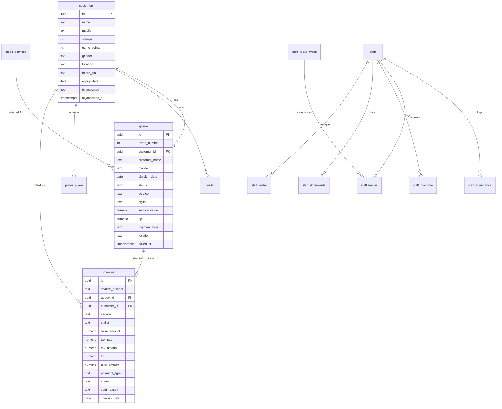

# Data Model — MiNiCUTS Loyalty

> **Last verified:** 2026-09-01 · **Source:** Supabase schema inspection + SQL queries

## Entity Relationship Overview

## Data Boundaries (Critical)

| Source | Date Range | Table | Rows |
|---|---|---|---|
| Excel import (historical) | up to 8 Jun 2026 | `historical_transactions` | ~5,858 |
| Live Supabase | from 9 Jun 2026 | `queue` | 1,743+ |

The constant `DB_CUTOFF = '2026-06-09'` in `index.html` controls this split. Analytics code merges both sources for revenue charts.

## Key Config Table

`staff_config` is a key-value store:

| Key | Content |
|---|---|
| `staff_config_data` | JSON: `{{ stylists[], waTemplate, passportBase, googleLink, instaLink }}` |
| `loyalty_config` | JSON: `{{ stampsNeeded, gameThresholds }}` |
| `co_settings` | JSON: invoice business info, VAT rate, services, WA invoice template |
| `tc_text` | HTML string: Terms & Conditions text |
| `gv_setup` | JSON: gift voucher types and packages |

## RLS Status

> ⚠️ Row Level Security is **DISABLED** on all tables. The anon key has full read/write access.
> See [KNOWN_RISKS_AND_TECHNICAL_DEBT.md](./KNOWN_RISKS_AND_TECHNICAL_DEBT.md).
