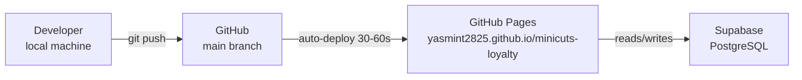

# Deployment Runbook — MiNiCUTS Loyalty

> **Last verified:** 2026-09-01 · **Source:** GitHub Pages settings, Supabase dashboard

## Deployment Architecture



## Deploy a Code Change

```bash
# 1. Make your changes to the HTML file(s)
# 2. Commit
git add minicuts-staff.html
git commit -m "feat: add checkout section separator for done rows"

# 3. Push to main — GitHub Pages auto-deploys
git push origin main

# 4. Verify (wait ~60 seconds)
open https://yasmint2825.github.io/minicuts-loyalty/minicuts-staff.html
```

## Deploy a Database Migration

```sql
-- Step 1: Run migration in Supabase SQL Editor
-- Dashboard → SQL Editor → New query

-- Example: add a new column
ALTER TABLE queue ADD COLUMN IF NOT EXISTS location text;

-- Step 2: Reload PostgREST schema cache
-- Dashboard → Settings → API → Reload schema

-- Step 3: Verify
SELECT column_name, data_type
FROM information_schema.columns
WHERE table_name = 'queue' AND column_name = 'location';
```

## Rollback

GitHub Pages deploys from git. To rollback:
```bash
git revert HEAD
git push origin main
# Pages redeploys automatically
```

For database rollbacks: there is no automated migration tool. Write a compensating SQL statement manually.

## GitHub Pages Settings

- **Repository:** `yasmint2825/minicuts-loyalty`
- **Branch:** `main`
- **Directory:** `/` (root)
- **Custom domain:** None currently
