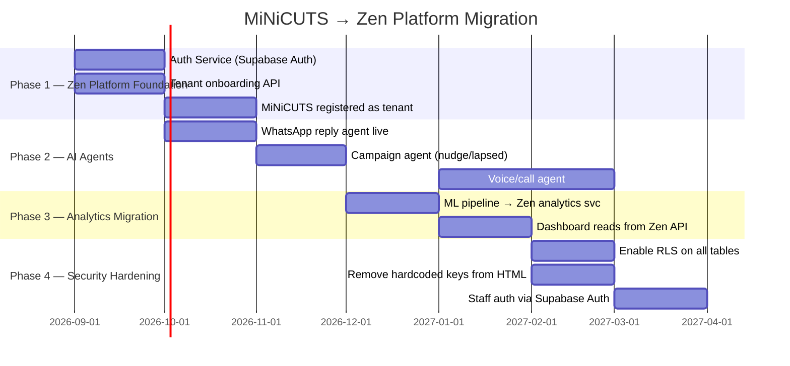

# Migration Plan — MiNiCUTS → Zen Platform

> **Last verified:** 2026-09-01 · **Source:** [adr/ADR-0005-INCREMENTAL-MIGRATION.md](./adr/ADR-0005-INCREMENTAL-MIGRATION.md)

## Strategy

Incremental migration — MiNiCUTS remains live throughout. No big-bang rewrite.

## Phase Details

### Phase 1 — Foundation
- Register MiNiCUTS as tenant in Zen Platform
- Replace anon key in HTML with Zen Platform API calls
- Supabase Auth for staff login (email/PIN → proper accounts)

### Phase 2 — AI Agents
- WhatsApp Business API replaces wa.me links
- Campaign agent handles lapsed customer nudges
- Voice agent answers phone calls

### Phase 3 — Analytics
- `historical_transactions` + `queue` data piped into Zen analytics service
- `index.html` analytics tab reads from Zen API endpoints

### Phase 4 — Security
- RLS enabled on all Supabase tables with tenant-scoped policies
- Hardcoded credentials removed from all HTML files
