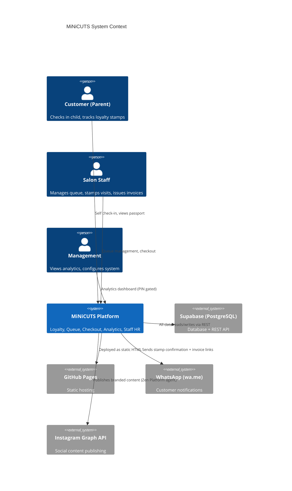

# System Context — MiNiCUTS Loyalty

> **Last verified:** 2026-09-01 · **Source:** product walkthrough + `index.html`, `minicuts-staff.html`

## Why This System Exists

MiNiCUTS FZCO is a children's hair salon in Dubai Silicon Oasis. Before this system, operations ran on paper: queue tokens were handwritten, loyalty stamps were physical cards, and revenue was tracked in Excel spreadsheets.

This system replaces all paper-based operations with a digital platform covering every customer and staff touchpoint.

## Context Diagram

## Scope

In scope:
- Customer check-in kiosk (new / returning / guest flows)
- Digital loyalty stamp card and passport portal
- Staff queue management (call, stamp, checkout)
- VAT invoicing with print and WhatsApp send
- Analytics dashboard (acquisition, operations, revenue)
- Staff HR (attendance, leaves, overtime, documents, roster)
- Gift vouchers and KoD (Kids of Determination) programme

Out of scope (handled by Zen Platform layer):
- AI-driven WhatsApp reply agent
- Outbound campaign automation
- Voice/call handling
- Multi-tenant management console
