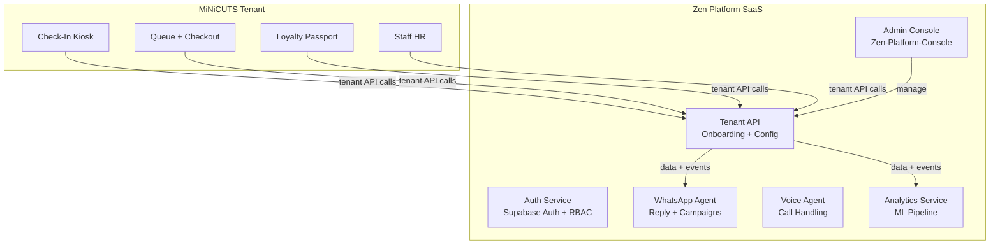

# Target Architecture Alignment — MiNiCUTS Loyalty

> **Last verified:** 2026-09-01 · **Source:** [Zen Platform docs](../../zen-platform/doc/README.md)

## MiNiCUTS as Tenant #1

MiNiCUTS is the **live pilot tenant** for Zen Platform — a multi-tenant AI engagement SaaS. The migration is incremental: MiNiCUTS continues to run as a standalone system while Zen Platform services are layered on top.

## Target State

## What Stays in This Repo

The MiNiCUTS-specific HTML files (kiosk, queue, passport) remain here. They will progressively delegate to Zen Platform APIs rather than calling Supabase directly.

## Migration Phases

See [MIGRATION_PLAN.md](./MIGRATION_PLAN.md) for the phased plan.
